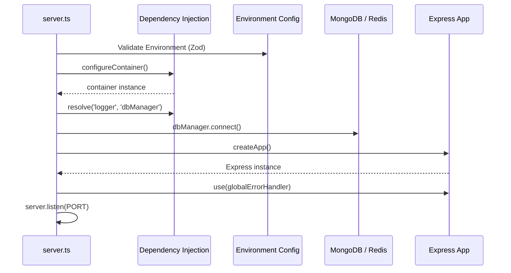
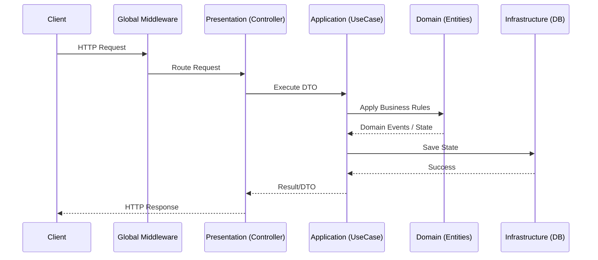
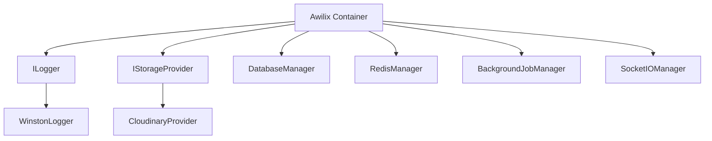
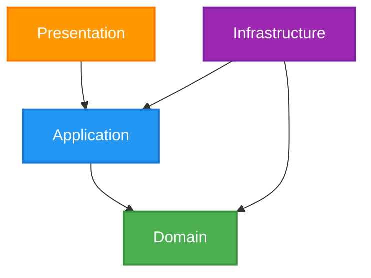
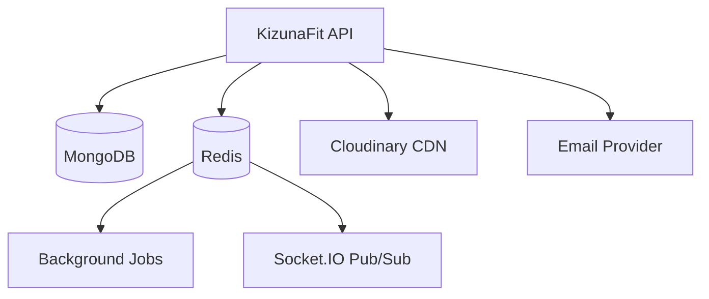
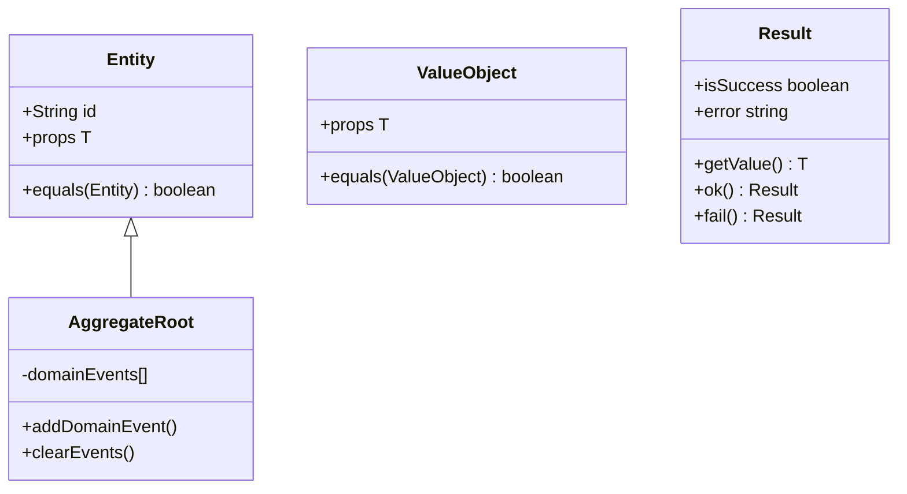

# 16. BACKEND FOUNDATION

## 1. Folder Structure

```text
backend/
├── src/
│   ├── bootstrap/
│   │   ├── dependency-injection/
│   │   ├── middleware/
│   │   └── startup/
│   ├── config/
│   ├── infrastructure/
│   │   ├── cache/
│   │   ├── database/
│   │   ├── logger/
│   │   ├── mail/
│   │   ├── queue/
│   │   ├── storage/
│   │   └── websocket/
│   ├── modules/ (Business Logic)
│   ├── shared/
│   │   ├── contracts/
│   │   ├── core/
│   │   ├── exceptions/
│   │   ├── result/
│   │   └── value-objects/
│   ├── app.ts (Express App)
│   └── server.ts (Entry Point)
```

## 2. Backend Bootstrap Lifecycle



## 3. HTTP Request Lifecycle



## 4. Dependency Injection Graph



## 5. Clean Architecture Dependency Flow



## 6. Infrastructure Component Diagram



## 7. Shared Kernel Diagram



## 8. Startup Sequence & Graceful Shutdown

* **Startup:** Validates config -> Wires dependencies -> Connects to databases -> Attaches Express middleware -> Listens on port.
* **Shutdown (SIGINT/SIGTERM):** Stops accepting requests -> Completes active requests -> Disconnects MongoDB -> Disconnects Redis -> Closes BullMQ connections -> Exits process (0).

## Environment Variables

* `NODE_ENV`: development | production | test
* `PORT`: Server port
* `MONGODB_URI`: MongoDB connection string
* `REDIS_URL`: Redis connection string
* `JWT_SECRET`: Secret for signing tokens
* `CLOUDINARY_URL`: Cloudinary API keys
