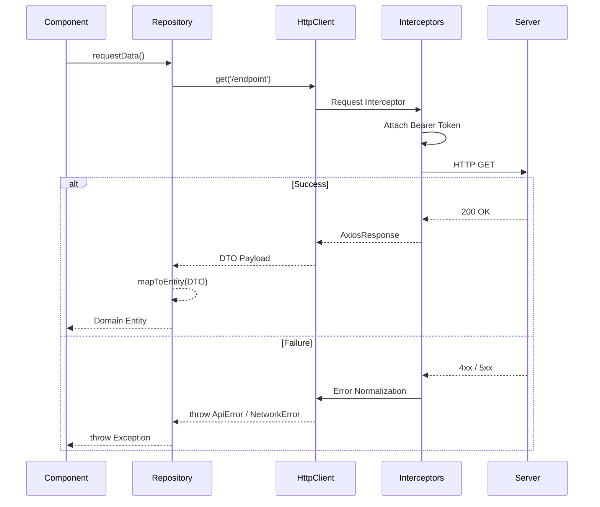
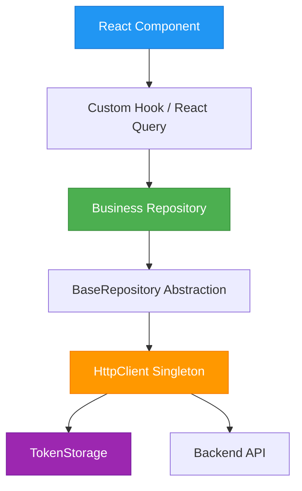

# 18. FRONTEND API FOUNDATION

## 1. HTTP Flow

The Frontend API Foundation is built on top of `axios`. It provides a centralized `HttpClient` that ensures every request made by the frontend complies with the system's security, error handling, and latency requirements.

## 2. Repository Flow & DTO Mapping

Business components must **never** make raw HTTP requests. They must consume Repositories.
The `BaseRepository` abstract class enforces the translation between Backend Data Transfer Objects (DTOs) and Frontend Domain Entities.

This ensures that if the API contract changes, only the Repository's `mapToEntity` function needs updating, not the React components.

## 3. Error Flow (Error Normalization)

Raw Axios errors are dangerous and inconsistent. The `HttpClient` intercepts all rejected promises and normalizes them into specific Domain Exceptions:
- `ApiError`: Contains `status`, `code`, and backend `message`.
- `NetworkError`: Thrown when no response is received.
- `TimeoutError`: Thrown when the 10,000ms limit is breached.

## 4. API Architecture Diagram

## 5. Token Storage Abstraction

The `TokenStorage` interface isolates the authentication token mechanisms from the HTTP client. By default, it uses `BrowserTokenStorage` (localStorage), but this abstraction allows swapping to Secure Cookies seamlessly if architectural requirements change.
