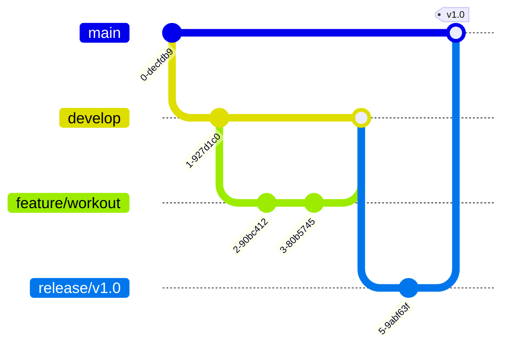
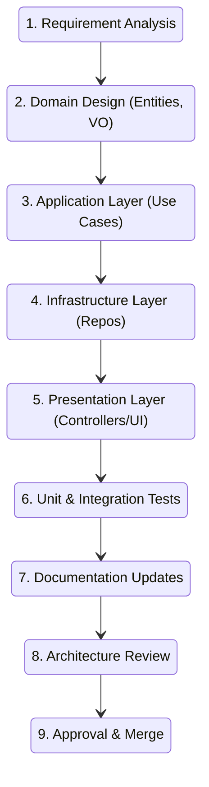
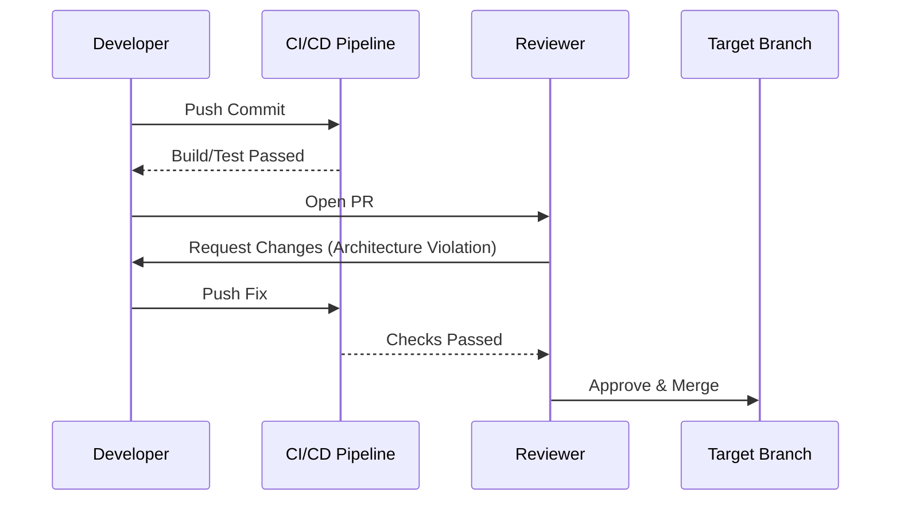

# 20. DEVELOPMENT WORKFLOW

This document is the official development handbook for KIZUNAFIT. Every contributor, whether human or AI, **must** strictly adhere to this workflow, architecture, and coding standard.

---

## 1. Project Philosophy

- **Clean Architecture:** Ensures business rules remain independent of UI, database, frameworks, and external services. Dependencies must point inward toward the Domain.
- **Domain-Driven Design (DDD):** Aligns the software model with the business domain. The business rules dictate the code structure, not the database tables.
- **Feature-First Architecture (Frontend):** Groups frontend code by feature (e.g., `Workout`, `Identity`) rather than technical concern (e.g., all `components`, all `hooks`), preventing decoupled sprawling legacy code.
- **Repository Pattern:** Isolates the application from data persistence technologies (Backend) and network transport details (Frontend).
- **SOLID Principles:** Enforces Single Responsibility, Open-Closed, Liskov Substitution, Interface Segregation, and Dependency Inversion across all modules.
- **Architectural Stability:** The foundation exists to prevent tech debt. Never bypass the architecture for "speed."

---

## 2. Branch Strategy

KIZUNAFIT utilizes a strict feature-branching strategy based on GitFlow.

| Branch Type | Naming Convention | Source Branch | Target Branch | Purpose |
| :--- | :--- | :--- | :--- | :--- |
| **Main** | `main` | - | - | Production-ready, stable releases. |
| **Develop** | `develop` | `main` | - | Integration branch for the next release. |
| **Feature** | `feature/<name>` | `develop` | `develop` | New features (e.g., `feature/identity-register`). |
| **Bugfix** | `bugfix/<name>` | `develop` | `develop` | Non-critical bug fixes. |
| **Hotfix** | `hotfix/<name>` | `main` | `main` & `develop` | Critical production patches. |
| **Release** | `release/<version>` | `develop` | `main` & `develop` | Preparation for a production release. |



---

## 3. Commit Convention

We enforce **Conventional Commits** (`type(scope?): description`).

| Type | Description | Example |
| :--- | :--- | :--- |
| `feat:` | A new feature | `feat(auth): implement jwt refresh flow` |
| `fix:` | A bug fix | `fix(cart): resolve rounding error in total` |
| `refactor:`| Code change that neither fixes a bug nor adds a feature | `refactor(domain): extract base entity logic` |
| `docs:` | Documentation only changes | `docs: update deployment steps in readme` |
| `style:` | Formatting, missing semi-colons, etc. | `style: run prettier on backend` |
| `test:` | Adding or correcting tests | `test(user): add unit tests for registration` |
| `build:` | Changes that affect the build system | `build: update tsconfig paths` |
| `ci:` | Changes to CI config files/scripts | `ci: add github action for linting` |
| `perf:` | A code change that improves performance | `perf(db): add index to user email` |
| `revert:` | Reverts a previous commit | `revert: feat(auth): implement jwt flow` |

---

## 4. Development Workflow

The lifecycle of implementing a feature must follow this strict sequence:



---

## 5. Module Creation Workflow

Every new business module (Backend or Frontend) **MUST** contain the following structure:

```text
module_name/
├── domain/
│   ├── entities/        (Required: Core models)
│   ├── events/          (Optional: Domain events)
│   ├── exceptions/      (Required: Domain specific errors)
│   ├── repositories/    (Required: Interfaces only)
│   └── value-objects/   (Required: Immutable types)
├── application/
│   ├── dtos/            (Required: Data Transfer Objects)
│   └── use-cases/       (Required: Business orchestration)
├── infrastructure/
│   └── repositories/    (Required: Repository implementations)
├── presentation/
│   ├── controllers/     (Required Backend: Express handlers)
│   ├── routes/          (Required Backend: Express routers)
│   └── components/      (Required Frontend: React UI)
└── tests/               (Required: Unit & Integration tests)
```

---

## 6. Coding Standards

- **File Naming**: PascalCase for Classes, Interfaces, and React Components (`UserRepository.ts`, `WorkoutCard.tsx`). camelCase for instances, utilities, and configs (`server.ts`, `cn.ts`). kebab-case for folders (`use-cases`).
- **Interface Naming**: Prefix with `I` (e.g., `IUserRepository`).
- **DTO Naming**: Suffix with `DTO` or `Request`/`Response` (e.g., `CreateUserDTO`).
- **Controller Naming**: Suffix with `Controller` (e.g., `UserController`).
- **Import Ordering**:
  1. Third-party packages (e.g., `react`, `express`).
  2. Absolute path imports (`@/shared/...`).
  3. Relative path imports (`../domain/...`).
- **Barrel Exports**: Use `index.ts` to export module layers cleanly.
- **Async Rules**: Avoid `.then()`. Use `async/await`. Always handle errors with `try/catch` or return early.

---

## 7. Pull Request Checklist

Every PR must verify:
- [ ] Build passes
- [ ] Lint passes
- [ ] Typecheck passes
- [ ] Tests pass
- [ ] No architecture violations
- [ ] Documentation updated
- [ ] No unnecessary dependencies
- [ ] No duplicated code
- [ ] No `console.log()`
- [ ] No `TODO` left

---

## 8. Code Review Checklist

Reviewers must explicitly check:
1. **Architecture**: Do dependencies point inward?
2. **SOLID**: Are classes single-responsibility?
3. **Naming**: Are variables declarative?
4. **Error Handling**: Are errors mapped correctly?
5. **Security**: Is input validated? (Zod)
6. **Performance**: Are DB queries optimized?
7. **Testing**: Are edge cases covered?
8. **Documentation**: Is the API Spec updated?



---

## 9. Testing Workflow

- **Unit Tests**: Test logic in isolation (Use Cases, Domain Entities, Utils). Use mocks for external dependencies.
- **Integration Tests**: Test repositories against real databases (MongoDB memory server) or API endpoints.
- **E2E Tests**: (Future) Test critical user journeys via Playwright.
- **Coverage**: Minimum 80% coverage on Shared Kernel and Domain layers.
- **Mock Strategy**: Use dependency injection to pass mock implementations (e.g., `MockEmailProvider`) rather than monkey-patching libraries.

---

## 10. Definition of Done

A feature is NOT complete until:
- [x] Business rules implemented accurately.
- [x] Unit and Integration tests written and passing.
- [x] Architecture verified (No dependency rule violations).
- [x] Documentation updated (Use Cases, API Spec).
- [x] Build, Lint, and Typecheck pass locally and in CI.
- [x] Reviewed by a Peer/Lead.
- [x] Approved.

---

## 11. Module Acceptance Checklist

Before a newly created module is merged, verify:
- **Domain Layer**: Contains no infra/presentation imports.
- **Application Layer**: Orchestrates logic using interfaces, not implementations.
- **Infrastructure Layer**: Encapsulates external libraries (Mongoose, Axios).
- **Presentation Layer**: Contains zero business rules. Validates raw input.
- **Tests**: Core paths validated.
- **Documentation**: Swagger/OpenAPI updated.

---

## 12. Architecture Rules (Non-Negotiable)

1. **Dependencies point inward**.
2. **Domain knows nothing about Express**. Express `Request` objects must never enter the Application layer.
3. **Domain knows nothing about MongoDB**. Entities must not extend Mongoose documents.
4. **Frontend components never call Axios directly**. They must call Repositories.
5. **Repositories own transport**. Repositories map external API calls to internal DTOs.
6. **DTOs never leak into UI**. Repositories must map Backend DTOs to Frontend Domain Entities.
7. **Business logic never belongs in controllers**. Controllers only route HTTP to Use Cases.

---

## 13. Project Folder Responsibilities

| Folder | Responsibility |
| :--- | :--- |
| `backend/` | The Node.js Express server boundary. |
| `frontend/` | The Next.js React application boundary. |
| `docs/` | Official project truth, architecture, and diagrams. |
| `scripts/` | Tooling for automation and database seeding. |
| `docker/` | Containerization definitions (docker-compose). |
| `.github/` | CI/CD pipelines and PR templates. |
| `shared/` | Cross-module utilities, core classes (`Entity`, `Result`). |
| `modules/` | The bounded contexts containing business features. |
| `bootstrap/` | (Backend) Server startup, DI registration, error middlewares. |
| `config/` | Application configuration and Zod env validation. |
| `infrastructure/` | Wrappers for 3rd party tools (Redis, Mongoose, Axios). |

---

## 14. Documentation Rules

Whenever a new feature is added, the following documents MUST be updated if applicable:
- `02_BUSINESS_RULES.md`
- `04_USE_CASES.md`
- `06_STATE_MACHINES.md`
- `07_ENTITY_MODELING.md`
- `08_DATABASE_DESIGN.md`
- `11_API_SPECIFICATION.md`

Documentation drift is treated as a severe defect.

---

## 15. Future Development Rules

From Phase 1 onward:
- **Never redesign the architecture** unless a serious, documented defect is found.
- **Implement one use case at a time**.
- **Validate after every implementation**. Do not write thousands of lines before testing.
- **Do not combine unrelated features** into one pull request.
- **Keep modules independent**. If `Workout` needs `User` data, pass an ID, do not share database schemas directly.
- **Maintain strict architectural boundaries.**
